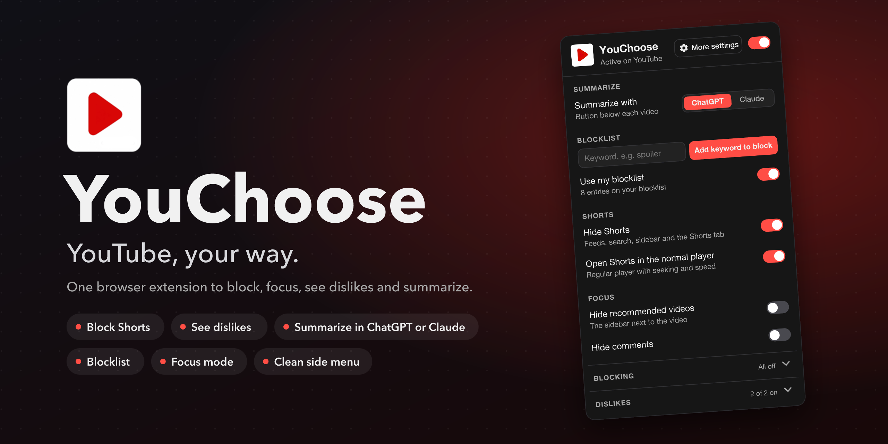
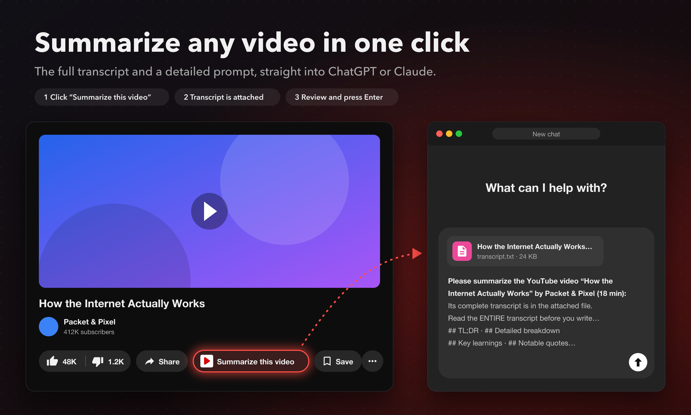
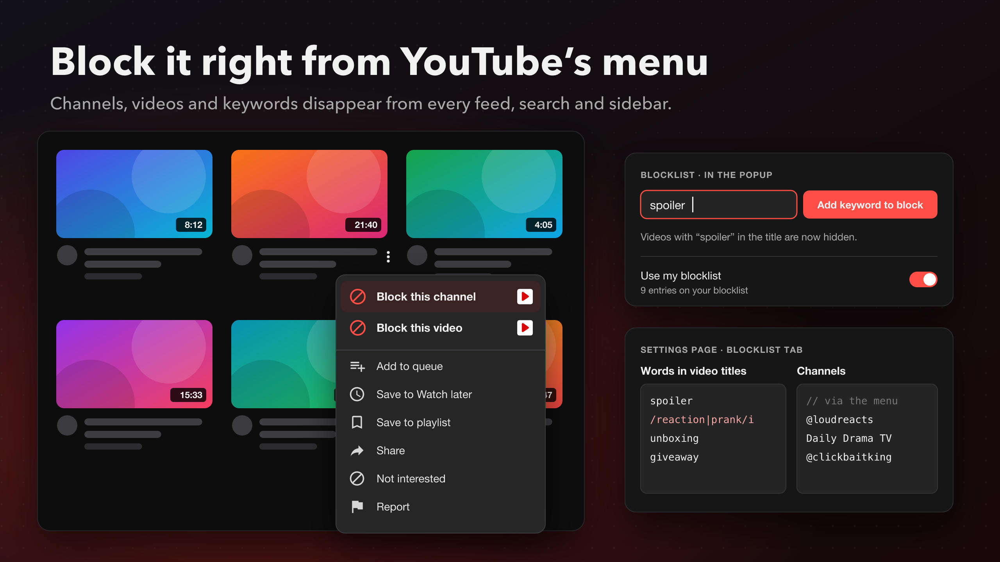
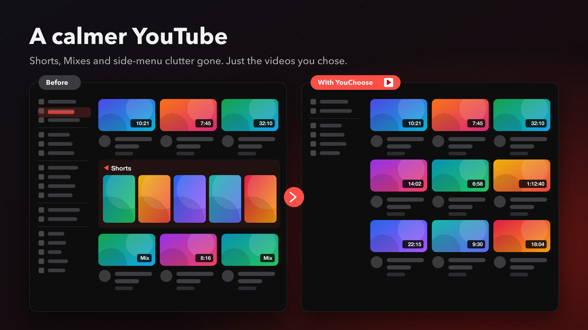
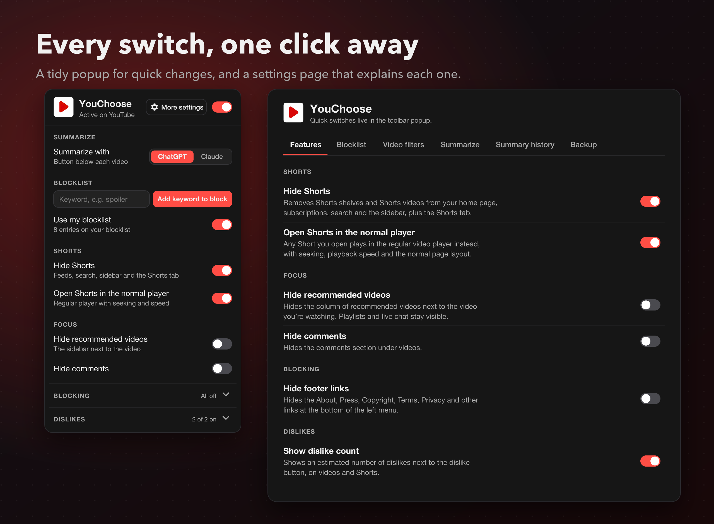

  

  
  
  
  

# YouChoose

**YouTube, your way.** YouChoose is one small browser extension that blocks Shorts, shows dislikes, hides distractions, filters out channels and videos you don't want, and summarizes any video in ChatGPT or Claude with one click.

No account, no server, no tracking. Plain JavaScript you can read in an afternoon.

---

## Summarize any video in one click

- A **Summarize this video** button sits below every video, in place of YouTube's own "Ask" button.
- One click fetches the video's full transcript and opens a new **ChatGPT** or **Claude** chat (your choice, at the top of the popup).
- The transcript is attached as a `.txt` file with timestamps, and a detailed summary prompt is filled in: TL;DR, section-by-section breakdown, key learnings, facts, actionable advice and quotes. Review it and press Enter.
- The prompt is fully editable, and every video you've summarized is listed under **Summary history** on the settings page.

## Block it right from YouTube's menu

- **Block this channel** and **Block this video** appear at the top of YouTube's own ⋮ menu on every video and comment. They're in the right-click menu too, under **YouChoose**.
- Type a word into **Add keyword to block** in the popup to hide every video with it in the title.
- On the settings page, manage everything at once: channels (name, @handle, ID or link), words in titles, specific videos and words in comments. Plain words match whole words; `/regex/` works too.
- Blocked channels' comments and live-chat messages disappear as well, and the whole blocklist can be paused with one switch.

## A calmer YouTube

- **Shorts:** hide them from feeds, search, the sidebar and the menu, and open any Short in the normal player.
- **Focus:** hide the recommended-videos sidebar and the comments.
- **Clean up:** hide Mixes, Movies, the Explore section, "More from YouTube", Report history and the footer links in the side menu.
- **Video filters:** hide videos that are too short, too long, or already watched.

## Every switch, one click away

- The **popup** has the switches you'll change often, with Blocking and Dislikes folded away to keep it short. **More settings** at the top opens the settings page.
- The **settings page** has tabs: Features (every switch, explained), Blocklist, Video filters, Summarize, Summary history and Backup.
- **Dislikes:** see an estimated dislike count next to the dislike button, plus a like/dislike ratio bar.
- Export and import all settings as a JSON file.

## Install

YouChoose isn't in a web store yet, so you load it straight from this folder:

1. Download this repository (**Code → Download ZIP**) and unzip it, or `git clone` it.
2. Open `chrome://extensions` (or `edge://extensions`, `brave://extensions`).
3. Turn on **Developer mode** (top right).
4. Click **Load unpacked** and select the folder that contains `manifest.json`.
5. Pin YouChoose from the puzzle-piece menu so its popup is one click away.

To update, pull the latest changes, click the reload icon on the YouChoose card, and refresh your YouTube tabs.

## Privacy

- No account, server, analytics or tracking. Settings stay in your browser (`chrome.storage.local`).
- Dislike counts are looked up by video ID only. Your own likes and dislikes are never sent anywhere.
- Summarizing fetches the captions from YouTube and puts them into the ChatGPT or Claude tab it opens. Nothing is sent until you press Enter, unless you turn on automatic sending.

## How it's built

Plain JavaScript, Manifest V3, no build step and no dependencies.

| Path | What it does |
| --- | --- |
| `shared/settings.js` | Default settings (including the summary prompt) and storage helpers. |
| `shared/matcher.js` | Turns the blocklist text into matchers. |
| `content/core.js` | Applies settings to the page and re-runs each feature when YouTube changes the page. |
| `content/youchoose.css` | Every hide rule. Each one is switched on by an attribute on `<html>`. |
| `content/redirects.js` | Opens Shorts in the normal player and redirects the Explore/Trending pages. |
| `content/blocklist.js` | Hides matching videos, comments and chat messages, and blocks watch and channel pages. |
| `content/menu.js` | Adds **Block this channel** / **Block this video** to the top of YouTube's ⋮ menus. |
| `content/dislikes.js` | Fetches dislike counts and adds them to the page. |
| `content/summarize.js` | The **Summarize this video** button under each video. |
| `summarize/transcript.js` | Fetches a video's captions through YouTube's app API, or a muted background YouTube tab if that's refused. |
| `summarize/format.js` | Builds the transcript file (paragraphs with `[m:ss]` timestamps) and fills in the prompt. |
| `summarize/chat-inject.js` | Runs in the new ChatGPT/Claude chat: attaches the transcript and writes the prompt. |
| `background.js` | The right-click menu, the "OFF" badge, and the summarize job (which also records the summary history). |
| `popup/` | The toolbar popup. |
| `options/` | The settings page. |
| `docs/images/` | The images in this README. |

## License

[MIT](LICENSE) © 2026 Abhinav Kuchhal
